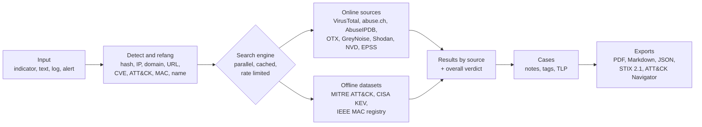

# astro

**A threat intelligence search engine.** Paste a hash, an IP, a domain, a URL, a
CVE, a MITRE ATT&CK ID, a MAC address or a threat name: astro recognizes it,
queries every intelligence source at once and tells you what is known about it,
with a single verdict.

Built for incident responders, SOC analysts, threat hunters and anyone solving
DFIR challenges such as Hack The Box Sherlocks or TryHackMe rooms.

[](https://github.com/ciruzz00/astro/actions/workflows/ci.yml)
[](LICENSE)

- [Why astro](#why-astro)
- [How it works](#how-it-works)
- [Quick start](#quick-start)
- [Command line](#command-line)
- [Cases and reports](#cases-and-reports)
- [Web interface](#web-interface)
- [REST API](#rest-api)
- [Sources and API keys](#sources-and-api-keys)
- [Security and OPSEC](#security-and-opsec)
- [Development](#development)
- [In italiano](#in-italiano)

## Why astro

During an investigation the same question comes up again and again: *what do
we know about this indicator?* Answering it means opening VirusTotal, abuse.ch,
AbuseIPDB, OTX, Shodan, NVD and the ATT&CK website one by one, copying the
indicator into each, and then writing down the results somewhere.

astro does that in one step:

- **One query, every source.** Indicators are searched in parallel across
  13 sources, with per-source timeouts, rate limits and a local cache that keeps
  you within free-tier quotas.
- **Understands what you paste.** Hashes (MD5, SHA1, SHA256, SHA512), IPv4/IPv6,
  domains, URLs, emails, CVEs, ATT&CK IDs (`T1059.001`, `G0032`, `S0154`…), MAC
  addresses and names (`"Lazarus Group"`) are detected automatically, and
  defanged input like `hxxps://evil[.]com` is accepted.
- **Works on whole logs.** Paste an alert, an email or a log file and astro
  extracts, refangs and de-duplicates every indicator in it.
- **Keeps your investigation.** Cases collect indicators, their latest results,
  notes and tags under a TLP marking, and export to PDF, Markdown, JSON,
  STIX 2.1 or an ATT&CK Navigator layer.
- **Fits your workflow.** Use it from the command line, from the browser
  (English or Italian), or from other tools through the REST API, for example
  to enrich EDR/SOAR alerts.
- **Works offline too.** MITRE ATT&CK, the CISA Known Exploited Vulnerabilities
  catalog and the IEEE MAC registry are stored locally, so sensitive indicators
  can be checked without anything leaving your machine.

## How it works



Each source returns its own verdict (`malicious`, `suspicious`, `clean` or
`info`), and the overall verdict of an indicator is the most severe one. For
example, an IP that VirusTotal rates clean but ThreatFox lists as a live
botnet C2 is reported as **malicious**, with both answers shown side by side.

astro is a single binary for Linux, macOS and Windows. It keeps its data in a
SQLite file readable only by its owner and runs locally: the web interface and
the API listen on `127.0.0.1` unless you decide otherwise.

## Quick start

Download the archive for your system from the
[releases page](https://github.com/ciruzz00/astro/releases), verify it and
extract the `astro` binary:

```sh
sha256sum --check --ignore-missing SHA256SUMS
gh attestation verify astro_<version>_<date>_<os>_<arch>.tar.gz --repo ciruzz00/astro
```

Then:

```sh
astro sync                         # download the offline datasets (once, then monthly)
astro search CVE-2021-44228        # first search, no API key needed
astro keys set virustotal          # optional: add API keys for more sources
astro token create web             # create a token to sign in to the web interface
astro serve                        # open http://127.0.0.1:8080
```

Packages are named `astro_<version>_<YYYY-MM-DD>_<os>_<arch>` and every release
comes with checksums and a build provenance attestation.

## Command line

```sh
astro search 44d88612fea8a8f36de82e1278abb02f           # a hash
astro search CVE-2021-44228 T1059.001 "Lazarus Group"   # several indicators
astro search "hxxps://evil[.]example[.]com"             # defanged input
astro search 00:50:56:aa:bb:cc                          # MAC vendor, VM detection
astro search --file incident.log                        # every IOC in a file
astro search --offline 10.0.0.5                         # nothing leaves this machine
astro search --only virustotal,malwarebazaar <hash>     # chosen sources only
astro search --json 8.8.8.8 | jq .                      # JSON for scripts
astro extract --defang report.txt                       # extract IOCs without searching
astro providers                                         # enabled sources and missing keys
```

## Cases and reports

A case is an investigation: the indicators you collected, the latest result of
each one, your notes and tags, and a [TLP 2.0](https://www.first.org/tlp/)
marking. Cases can be resumed and searched again at any time.

```sh
astro case new brutus --title "HTB Sherlock: Brutus" --tlp green --tag htb
astro case add brutus -f auth.log --search          # extract, add and search IOCs
astro search --case brutus "Lazarus Group"          # save any search into a case
astro case note brutus "Initial access via SSH brute force"
astro case show brutus
astro case export brutus --format pdf -o brutus     # pdf, md, json, stix, navigator
```

| Format | What it is for |
|---|---|
| **PDF** | A report to hand over or print: summary, indicator table, results by source and notes, with the TLP label at the top and bottom of every page. |
| **Markdown** | A readable report for tickets, wikis and write-ups. |
| **JSON** | All the case data, for automation. |
| **STIX 2.1** | A bundle for threat intelligence platforms (MISP, OpenCTI…), marked with the official OASIS TLP 2.0 definitions; IDs are stable, so re-imports do not duplicate objects. |
| **ATT&CK Navigator** | A layer highlighting the case techniques and those referenced by threat intel on its indicators. |

PDF and Markdown reports defang indicators (notes included) and escape all
provider data, so they are safe to share and render.

## Web interface

```sh
astro token create web    # prints a token once: it is your password for the interface
astro serve               # http://127.0.0.1:8080
```

Everything the command line does is available in the browser, in English or
Italian: search (one indicator per line, text extraction, file upload, source
selection, offline mode), IOC extraction with bulk actions, a dashboard, cases
with every action and export, dataset sync, provider API keys (save, test,
remove), access tokens, and a built-in guide that explains every section and
export format.

The interface is rendered on the server and works without JavaScript; a
vendored, integrity-checked copy of htmx makes navigation faster. Sessions use
HttpOnly, SameSite=Strict cookies, cross-origin form posts are rejected and a
strict Content-Security-Policy forbids inline scripts.

## REST API

The API is served by `astro serve` under `/api/v1` and described by an OpenAPI
3.1 document at `/api/v1/openapi.json`. Requests are authenticated with
`Authorization: Bearer <token>`.

| Endpoint | Description |
|---|---|
| `GET /api/v1/health` | liveness (no token) |
| `GET /api/v1/openapi.json` | OpenAPI 3.1 spec (no token) |
| `GET /api/v1/providers` | sources and whether they are enabled |
| `GET /api/v1/search?q=<indicator>` | search one indicator (`only`, `offline`, `no_cache`) |
| `POST /api/v1/search` | search up to 100 indicators |
| `POST /api/v1/extract` | extract indicators from text |
| `POST /api/v1/enrich` | extract from an alert or text, search, and return an overall verdict |
| `GET /api/v1/cases` · `POST /api/v1/cases` | list or create cases |
| `GET /api/v1/cases/{name}` | a case with indicators, results and notes |
| `POST /api/v1/cases/{name}/indicators` | add indicators or free text, optionally searching them |
| `GET /api/v1/cases/{name}/export?format=` | export as `pdf`, `md`, `json`, `stix` or `navigator` |

```sh
curl -H "Authorization: Bearer $ASTRO_TOKEN" "http://127.0.0.1:8080/api/v1/search?q=8.8.8.8"
curl -H "Authorization: Bearer $ASTRO_TOKEN" -H "Content-Type: application/json" \
     -d '{"text":"beacon to hxxps://evil[.]example[.]com from 203.0.113.7"}' \
     http://127.0.0.1:8080/api/v1/enrich
```

**EDR / SOAR integration.** `/enrich` is designed for automation: a SentinelOne
Singularity Hyperautomation workflow, or any SOAR, can send an alert as `text`
and branch on `verdict` (`malicious`, `suspicious`, `clean`), using the
`malicious` and `suspicious` lists to act on the offending indicators.

Tokens are 256-bit random values stored only as SHA-256 hashes
(`astro token list`, `astro token revoke <name>`). Requests are rate limited per
token and bodies are capped at 1 MB. To expose the server beyond localhost, pass
`--allow-remote` and use TLS (`--tls-cert`/`--tls-key` or a reverse proxy).

## Sources and API keys

| Source | Indicators | API key | Network |
|---|---|---|---|
| MITRE ATT&CK | ATT&CK IDs, group/software/campaign names | no | offline |
| VirusTotal | hash, IP, domain, URL | required | online |
| MalwareBazaar (abuse.ch) | MD5, SHA1, SHA256 | required | online |
| ThreatFox (abuse.ch) | hash, IP, domain, URL | required | online |
| URLhaus (abuse.ch) | URL, domain, IP, payload hashes | required | online |
| AbuseIPDB | IP | required | online |
| AlienVault OTX | hash, IP, domain, URL, CVE | required | online |
| GreyNoise Community | IPv4 | optional | online |
| Shodan (InternetDB without a key) | IP | optional | online |
| NVD | CVE | optional | online |
| CISA KEV | CVE | no | offline |
| FIRST EPSS | CVE | no | online |
| IEEE OUI | MAC address | no | offline |

Every key is free and optional: sources that need a key are simply skipped
until you add it.

| Service | Where to get a key | Free tier |
|---|---|---|
| VirusTotal | [virustotal.com](https://www.virustotal.com/gui/join-us) → [API key](https://www.virustotal.com/gui/my-apikey) | 4 requests/min, 500/day, non-commercial |
| abuse.ch | [auth.abuse.ch](https://auth.abuse.ch/) → Auth-Key (one key for all services) | fair use |
| AbuseIPDB | [abuseipdb.com](https://www.abuseipdb.com/register) → [API](https://www.abuseipdb.com/account/api) | 1,000 checks/day |
| AlienVault OTX | [otx.alienvault.com](https://otx.alienvault.com/) → Settings | generous |
| Shodan | [account.shodan.io](https://account.shodan.io/register) | limited credits ([InternetDB](https://internetdb.shodan.io/) needs no key) |
| GreyNoise | [viz.greynoise.io](https://viz.greynoise.io/signup) → Account → API Key | limited lookups |
| NVD | [nvd.nist.gov](https://nvd.nist.gov/developers/request-an-api-key) | raises the limit from 5 to 50 requests per 30s |

Keys can be set in three places, in order of precedence: environment variables
(see [`.env.example`](.env.example)), the web interface or `astro keys set`
(stored in the owner-only database and never displayed again), and
`config.toml` in the data directory (`$ASTRO_DATA_DIR`, or `~/.config/astro` on
Linux, `~/Library/Application Support/astro` on macOS, `%AppData%\astro` on
Windows). New keys take effect immediately.

```sh
astro keys list              # where each key comes from
astro keys set virustotal    # prompts without echo (or reads stdin)
astro keys test virustotal   # harmless lookup on every provider using the key
astro keys unset virustotal
```

## Security and OPSEC

- **Searches are disclosures.** Online sources receive the indicators you
  search, and some share lookups with their community. Use `--offline` (or
  *Offline only* in the web interface) for internal or sensitive indicators.
- Lookups only contact the fixed API endpoints of each source: searched URLs
  and domains are sent as data and never fetched.
- API keys and tokens are never logged or printed; error messages strip query
  strings.
- Provider data is treated as untrusted: it is escaped in the web interface and
  reports, and control characters are stripped before reaching the terminal.
- Outbound HTTPS requires TLS 1.2+, redirects never downgrade to HTTP and
  response sizes are capped.
- The database and config are owner-only; the server listens on localhost by
  default.
- Few, maintained dependencies, all checked with `govulncheck`, `gosec` and
  `staticcheck` in CI; GitHub Actions are pinned by commit.

Please report vulnerabilities privately through
[GitHub security advisories](https://github.com/ciruzz00/astro/security/advisories/new).

## Development

astro is written in Go and built entirely in Docker: no Go toolchain is needed
on the host.

```sh
make try      # shell with astro built and on the PATH (keys from .env)
make test     # go test -race
make check    # verify, vet, staticcheck, gosec, govulncheck and tests (same as CI)
make serve    # web interface and API on http://127.0.0.1:8080
make cross    # release archives for every OS and architecture in dist/
make help     # every target
```

```
cmd/astro/          command line, server and wiring
internal/ioc/       indicator detection, refang/defang, extraction
internal/provider/  one package per intelligence source
internal/engine/    parallel search, cache, verdicts
internal/datasets/  offline ATT&CK, KEV and MAC datasets
internal/cases/     investigations
internal/report/    PDF, Markdown, JSON, STIX 2.1 and Navigator exports
internal/api/       REST API and OpenAPI spec
internal/web/       web interface (templates, translations, static files)
internal/store/     SQLite storage and migrations
```

## In italiano

astro è un motore di ricerca per la threat intelligence. Incolli un hash, un IP,
un dominio, un URL, una CVE, un ID MITRE ATT&CK, un MAC address o il nome di una
minaccia: astro lo riconosce, lo cerca in parallelo su 13 fonti (VirusTotal,
abuse.ch, AbuseIPDB, OTX, GreyNoise, Shodan, NVD, EPSS e i dataset offline
MITRE ATT&CK, CISA KEV e registro MAC IEEE) e restituisce un verdetto unico.

Si usa da riga di comando, dal browser (interfaccia in italiano e inglese, con
guida integrata) o tramite REST API, ad esempio per arricchire gli alert di un
EDR o di un SOAR. I **casi** raccolgono indicatori, risultati, note e tag con
una marcatura TLP e si esportano in PDF, Markdown, JSON, STIX 2.1 o come layer
di ATT&CK Navigator. È pensato per incident response, SOC, threat hunting e
challenge DFIR come le Sherlock di Hack The Box e TryHackMe.

## License

[MIT](LICENSE) © 2026 Gennaro Justin Casale
